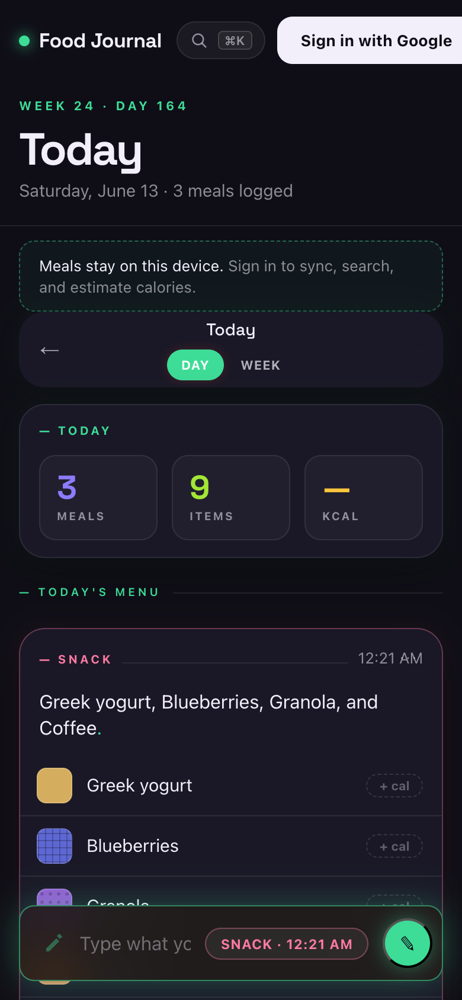
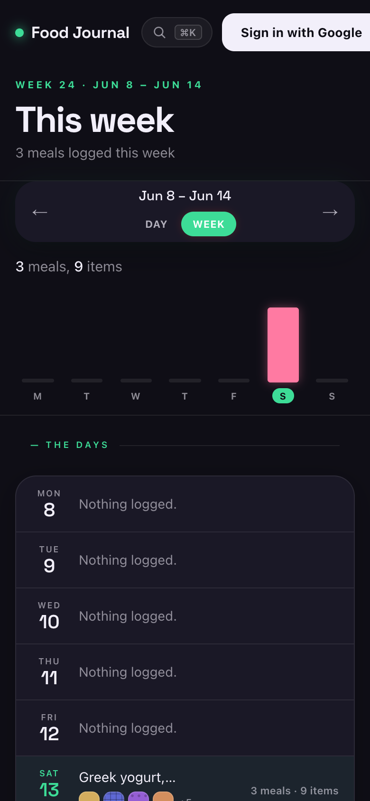
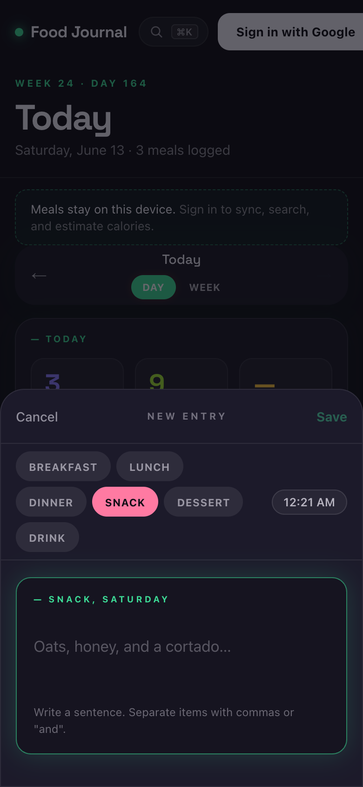
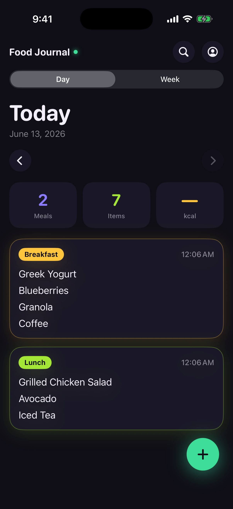
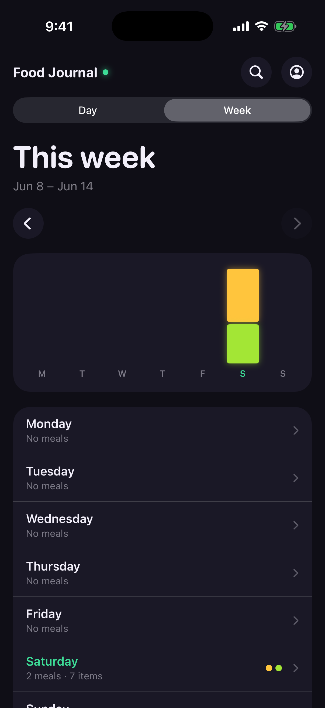
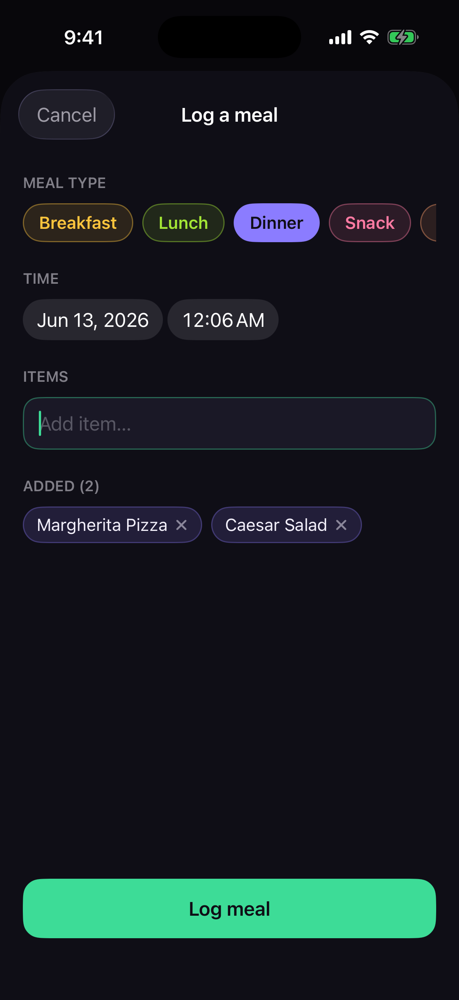

# Food Journal

A meal logging app for web and iOS. Log meals as a quick sentence or chip input, get auto-estimated calories, and review daily and weekly stats. The web client and the native iOS app share one Supabase backend.

Live at **[food.folkes.dev](https://food.folkes.dev)**

## Screenshots

### Web

<table>
  <tr>
    <td align="center"><strong>Day</strong></td>
    <td align="center"><strong>Week</strong></td>
    <td align="center"><strong>Compose</strong></td>
  </tr>
  <tr>
    <td></td>
    <td></td>
    <td></td>
  </tr>
</table>

### iOS

<table>
  <tr>
    <td align="center"><strong>Day</strong></td>
    <td align="center"><strong>Week</strong></td>
    <td align="center"><strong>Compose</strong></td>
  </tr>
  <tr>
    <td></td>
    <td></td>
    <td></td>
  </tr>
</table>

## Stack

- **Web client**: React 19 + Vite + TypeScript, vanilla CSS
- **iOS app**: SwiftUI + SwiftData, on-device calorie estimation via Apple Foundation Models (iOS 26+)
- **Auth + DB**: Supabase (Google OAuth, Postgres + RLS)
- **State**: Zustand with localStorage (anonymous) ↔ Supabase (signed in)
- **API functions**: Vercel serverless (Node.js) — USDA calorie lookup
- **Calorie data**: USDA FoodData Central API (web), Apple Foundation Models (iOS) — cached in `food_lookup` table

## Setup

### 1. Supabase — run migrations

In your Supabase dashboard → **SQL Editor**, run each file in order:

```
supabase/migrations/0001_init.sql                      -- legacy entries table (dropped in 0011)
supabase/migrations/0002_meals.sql                     -- meals + meal_items tables + RLS
supabase/migrations/0003_meal_items_calories.sql       -- calories column on meal_items
supabase/migrations/0004_food_lookup.sql               -- USDA cache table
supabase/migrations/0005_sync_meals_schema.sql         -- raw_input + updated_at on meals
supabase/migrations/0006_transactional_meal_writes.sql -- transactional meal RPCs
supabase/migrations/0007_batch_sync_local_meals.sql    -- batched local-to-remote sync RPC
supabase/migrations/0008_search_meals_rpc.sql          -- search RPC + trigram index
supabase/migrations/0009_entries_user_id_default.sql   -- user_id default on entries
supabase/migrations/0010_food_lookup_rls_fix.sql       -- tighten food_lookup INSERT policy
supabase/migrations/0011_drop_entries_table.sql        -- drop unused entries table
supabase/migrations/0012_food_lookup_growth_bound.sql  -- 90-day cache TTL + cleanup index
supabase/migrations/0013_api_rate_limit.sql            -- per-user hourly rate-limit table
supabase/migrations/0014_get_prior_item_descriptions.sql -- RPC for "new this week" detection
supabase/migrations/0015_set_updated_at_search_path.sql  -- security: pin search_path on trigger
supabase/migrations/0016_get_recent_item_descriptions.sql -- RPC for autocomplete suggestions
supabase/migrations/0017_editorial_columns.sql         -- headline, notes, and qty columns
```

After running `0007` and `0008`, verify the new SQL objects exist:

```sql
select proname
from pg_proc
where proname in ('create_meals_with_items_batch', 'search_meals')
order by proname;

select indexname
from pg_indexes
where schemaname = 'public'
   and tablename = 'meal_items'
   and indexname = 'meal_items_description_trgm';
```

Expected result:
- both RPC names are returned from `pg_proc`
- the `meal_items_description_trgm` index is returned from `pg_indexes`

### 2. Supabase — enable Google OAuth

1. Dashboard → **Authentication → Providers → Google** → toggle on
2. Create OAuth credentials at **Google Cloud Console → APIs & Services → Credentials → Create OAuth 2.0 Client ID**
   - Type: **Web application**
   - Authorised origins: `http://localhost:5173` and your production URL
   - Redirect URI: the Callback URL shown in Supabase Google provider settings
3. Paste Client ID and Secret back into Supabase
4. Add your production domain to **Authentication → URL Configuration → Redirect URLs**

### 3. Client — environment variables

```bash
cd client
cp .env.example .env.local
```

Fill in `client/.env.local`:
```
VITE_SUPABASE_URL=https://<your-project>.supabase.co
VITE_SUPABASE_ANON_KEY=<anon key from Supabase Dashboard → Project Settings → API>
```

### 4. Vercel API — environment variables

The `/api/usda-lookup` serverless function needs these set in your Vercel project settings:

| Variable | Where to get it |
|---|---|
| `SUPABASE_URL` | Supabase Dashboard → Project Settings → API |
| `SUPABASE_ANON_KEY` | Supabase Dashboard → Project Settings → API |
| `SUPABASE_SERVICE_ROLE_KEY` | Supabase Dashboard → Project Settings → API (service_role) |
| `USDA_API_KEY` | Sign up free at [fdc.nal.usda.gov/api-key-signup](https://fdc.nal.usda.gov/api-key-signup) |

### 5. Run the dev server

```bash
cd client
npm install
npm run dev
```

Open [http://localhost:5173](http://localhost:5173).

> **Note:** The `/api/usda-lookup` serverless function only runs in Vercel's environment. Calorie estimation won't work locally unless you run `vercel dev` from the repo root.

## Scripts

From `client/`:

| Command | Description |
|---|---|
| `npm run dev` | Start dev server |
| `npm run build` | Type-check + build for production |
| `npm run lint` | Run ESLint |
| `npm test` | Run Vitest unit tests |
| `npm run test:e2e` | Run Playwright E2E tests (requires `npx playwright install`) |

## CI

GitHub Actions runs **lint**, **unit tests**, and **build** on every push to `main` and on every pull request. See [`.github/workflows/ci.yml`](.github/workflows/ci.yml).

## Project structure

```
food_journal/
├── api/
│   ├── admin/
│   │   └── flush-cache.ts        # Admin-only: flush food_lookup cache
│   ├── logger.ts                 # Shared server-side logger
│   ├── usda-cache.ts             # Cache read/write helpers for food_lookup
│   └── usda-lookup.ts            # Vercel serverless: USDA calorie lookup + cache
├── client/
│   ├── public/                   # PWA manifest, icons, favicons
│   ├── e2e/                      # Playwright E2E tests
│   └── src/
│       ├── components/
│       │   ├── MealComposer.tsx       # Full-screen compose sheet
│       │   ├── QuickLogBar.tsx        # Inline quick-log bar on day view
│       │   ├── MealCard.tsx           # Per-meal card with items + calorie chips
│       │   ├── MealLog.tsx            # Day view meal list
│       │   ├── WeekView.tsx           # Stacked bar chart + weekly summary
│       │   ├── SearchOverlay.tsx      # Full-text search overlay
│       │   ├── EditMealModal.tsx      # Edit existing meal
│       │   ├── PdfExportModal.tsx     # PDF export with theme picker
│       │   ├── RecentChips.tsx        # Recent item autocomplete chips
│       │   └── ...                    # DateNav, DaySummary, Toast, etc.
│       └── lib/
│           ├── store.ts               # Zustand store (anon + authed)
│           ├── supabase.ts            # Supabase client
│           ├── parser.ts              # chrono-node chip parsing
│           ├── mealType.ts            # Meal type suggestion by time of day
│           ├── caloriesLookup.ts      # Client-side USDA fetch helper
│           ├── pdfThemes.ts           # PDF theme (voice + accent) definitions
│           ├── tileMap.ts             # Day summary tile layout helpers
│           ├── date.ts                # Date helpers
│           ├── analytics.ts           # Typed Vercel Analytics event wrapper
│           └── toast.ts               # Toast notification state
├── ios/
│   ├── project.yml                    # XcodeGen spec (source of truth)
│   ├── Config/                        # xcconfig build settings + Secrets
│   └── FoodJournal/
│       ├── App/                       # FoodJournalApp, ContentView
│       ├── Auth/                      # AuthManager, SignInView
│       ├── Data/                      # MealsRepository, WriteOperations, DTOs,
│       │                              #   CaloriesService, SupabaseClientProvider
│       ├── Models/                    # SwiftData models, MealType, DateHelpers
│       ├── Theme/                     # Colors (arcade-glow palette)
│       └── Views/                     # DayView, WeekView, MealCardView,
│                                      #   MealComposerView, SearchView, EditMealView
├── shared/
│   ├── logger.ts                 # Shared logger (api + vercel functions)
│   ├── types/
│   │   └── database.ts           # Supabase table + RPC types (shared by client + api)
│   └── usda-lookup.ts            # Shared lookup request/response types
├── supabase/
│   └── migrations/               # SQL migrations (run in order, 0001–0017)
└── vercel.json                   # Build config + API rewrites
```

## Database schema

```
meals          — one record per eating occasion (meal_type, consumed_at, user_id)
                 plus raw_input and updated_at metadata used by the app
  └── meal_items — food items within a meal (description, calories, position)

food_lookup    — shared USDA calorie cache (description_key, calories_per_100g)
```

## Features

### Web

- **Chip-style meal composer** — type items separated by Enter or comma
- **Autocomplete** — recent item suggestions while composing
- **Meal types** — Breakfast / Lunch / Dinner / Snack / Dessert / Drink, auto-suggested by time
- **Color-coded meal cards** — distinct accent color per meal type
- **Day + week views** — daily summary tiles and a stacked bar chart by meal type
- **Calorie tracking** — manual entry or auto-estimated from USDA FoodData Central
- **Search** — full-text search across all logged items
- **PDF export** — styled weekly archive (magazine, clinical, or field-notes themes)
- **Dark mode** — respects system preference
- **PWA** — installable on mobile (Add to Home Screen)
- **Undo delete** — 5-second grace period after deleting a meal

### iOS

- **Native SwiftUI app** — day view, week view, compose, edit, search, and sign-in screens
- **Offline-first** — SwiftData local persistence with background sync to Supabase
- **On-device calorie estimation** — Apple Foundation Models (iOS 26+, requires Apple Intelligence)
- **Haptics + accessibility** — sensory feedback, Dynamic Type, VoiceOver support
- **Shared backend** — same Supabase project, RLS policies, and RPCs as the web app
